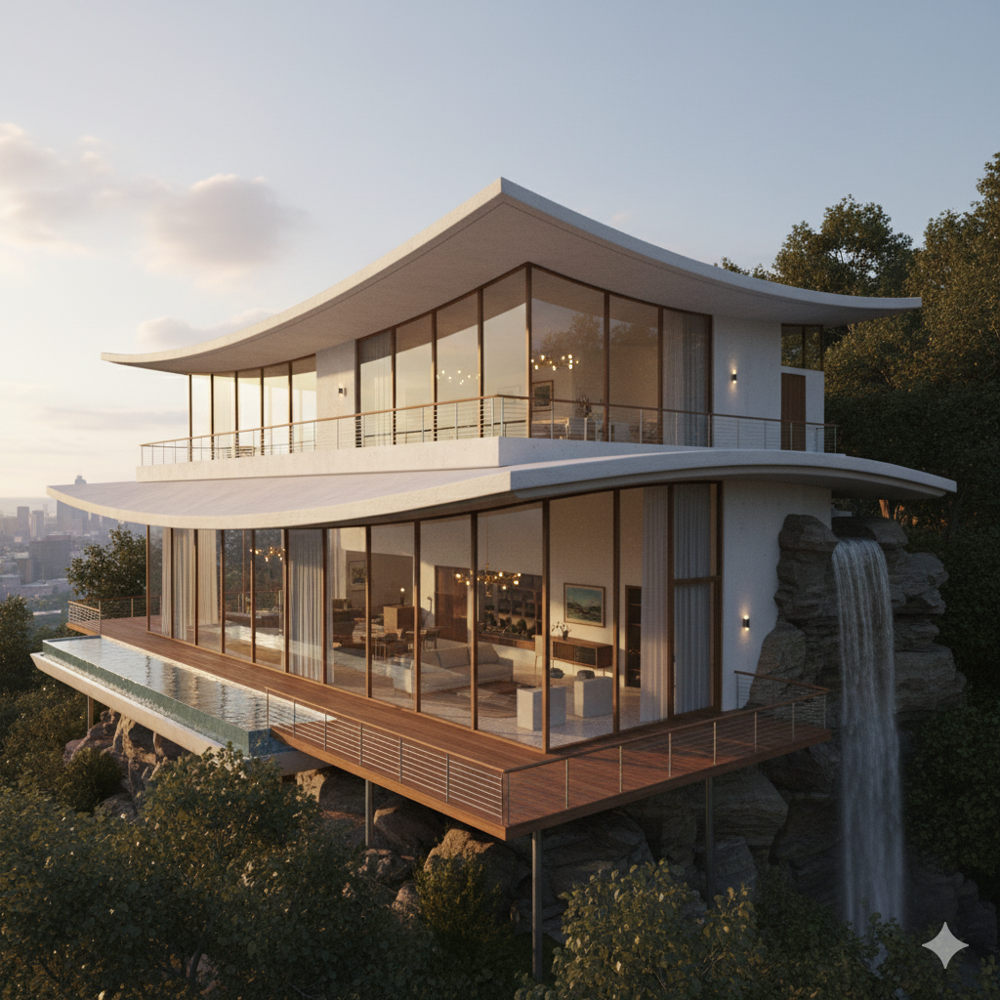

# Architecture Portfolio Universe

A collection of architectural portfolios showcasing AI-generated visualizations, detailed research, and comprehensive documentation across various fictional and real-world architectural projects.

## About This Project

This repository explores the intersection of **architectural design** and **AI image generation**, creating professional-grade architectural portfolios complete with:

- Detailed architectural research and analysis
- Site plans, floor plans, and elevation drawings
- Photorealistic 3D perspective renderings
- Interior spatial visualizations
- Specialized AI prompts for image generation

Each "universe" represents a complete architectural project with its own research, prompts, and generated visualizations.

---

## Portfolio Universes

### The Incredibles: Parr Residence

**[View Complete Portfolio →](universe/incredibles/portfolio.md)**



A comprehensive architectural documentation of the iconic 20,000-square-foot mid-century modern mansion from Pixar's *Incredibles 2*. This portfolio translates the animated design into buildable, high-end residential architecture.

**Key Features:**
- Hyperbolic paraboloid roof inspired by James Evans's 1961 Connecticut residence
- Dramatic cliffside integration with cascading waterfall
- Floor-to-ceiling glass curtain walls throughout
- 4.6-acre forested site with panoramic city views
- Complete documentation: site plans, floor plans (3 levels), elevations (4 directions), and interior renderings

**Portfolio Contents:**
- 📐 Site Plan & Contextual Analysis
- 🏠 Architectural Plans (Main, Second, Basement Levels)
- 📏 Exterior Elevations (South, West, North, East)
- 📸 Perspective Renderings (Southwest, Aerial, Approach, Sunset)
- 🪑 Interior Visualizations (Living Room, Master Suite, Kitchen)
- 📝 Detailed Prompt Suite for AI Generation

**Research & Prompts:**
- [Deep Research Document](universe/incredibles/research/incredibles_2_mansion_deep_research.md) - Architectural analysis and AI generation techniques
- [Prompt Suite](universe/incredibles/research/prompts.md) - Specialized prompts for each visualization type

---

## Coming Soon

More architectural universes will be added here, each with their own complete portfolio documentation.

---

## Repository Structure

```
architecture_demo/
├── universe/
│   ├── incredibles/              # Incredibles 2 Parr Residence
│   │   ├── images/               # Generated visualizations
│   │   ├── research/             # Architectural research & prompts
│   │   └── portfolio.md          # Complete portfolio presentation
│   └── [future_projects]/        # Additional architectural portfolios
├── generated_images/             # Output directory for new renders
├── CLAUDE.md                     # Development guidance
└── README.md                     # This file
```

## Technology & Tools

This project leverages cutting-edge AI image generation for architectural visualization:

- **Google Gemini 2.5 Flash Image** ("Nano Banana") - Primary image generation
- **Imagen 3/4** - Deterministic generation with seed control
- **Prompt Engineering** - Specialized architectural visualization techniques
- **Research-Driven Design** - Comprehensive architectural analysis informing AI prompts

## Prompt Engineering Methodology

Each portfolio follows a rigorous workflow:

1. **Architectural Research** - Deep analysis of design, materials, spatial relationships
2. **Prompt Development** - Hierarchical prompts organized by visualization type
3. **Iterative Generation** - Testing and refinement using AI image models
4. **Portfolio Assembly** - Professional documentation with comprehensive imagery

## How to Use This Repository

### Viewing Portfolios
Click on any portfolio link above to explore the complete architectural documentation, including all generated images and detailed descriptions.

### Understanding the Process
Review the research documents within each universe to understand the architectural analysis and prompt engineering techniques used.

### Adding New Portfolios
See [CLAUDE.md](CLAUDE.md) for detailed guidance on repository structure and conventions.

## License

This project is licensed under the MIT License - see [LICENSE](LICENSE) file for details.

---

**Built with research, precision, and AI innovation.**
